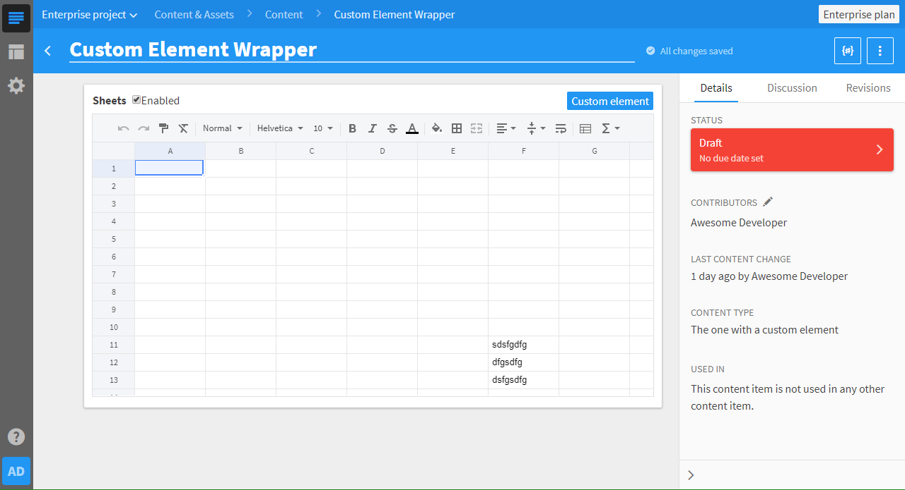

# Development Kit for Custom Elements in Kentico Cloud

This repository contains several custom content elements for the [Kentico Cloud](https://kenticocloud.com/) platform.

If you want more information on Kentico Cloud, [head here](https://kenticocloud.com/docs-and-tutorials), or [contact us via email](mailto:cloud@kentico.com).

If you're familiar with the CMS, but would like to know more about custom elements, [you might find this interesting](https://developer.kenticocloud.com/docs/integrating-content-editing-features).

## How to use this repository

### Scripts

`npm start` will start the server script in default configuration. For more info about configuration run `npm start -- --help` (For `npm` wants the argument vector for the command it's running after `--`.)

`npm run start-watcher` will start the node server and a compiler watching for changes in the files compiled for the client-side. This is useful when you're trying to create or debug your custom elements.

If you leave this running on a publicly accessible server, you'll be able to use all the elements served by the server in the cloud. The URL is in this format: `<the root to your instance>/custom-elements/<element name>`. However this is not recommended for security reasons.

What `<element name>` stands for is dealt with below, read on.

`npm run tslint` is here to give a bit of culture to the code and avoid unnecessary mistakes.

`npm run typecheck` is here to simply check for type errors when you're ready to do so.

`npm run typewatch` is your friend, when you want to have the type-check result ready all the time.

### Adding custom elements

Put very simply, just follow the example. The "sheets" elements was the first one here and it serves as a reference.

#### Step by step:

1) Create a folder in _<root>/client_. Give it a name, you want your element to have. The folder name will be used in the element's URL, hence avoid white spaces or special characters.

1) In the folder, you have just created, create _index[.pug](https://pugjs.org/api/getting-started.html)_. Ideally make it [extend](https://pugjs.org/language/inheritance.html) the layout located in _../../../server/views/custom-element-layout_ relatively to the just created _index.pug_.

   If you decide to extend the provided layout, don't forget to specify the `block content` in order to provide the HTML basis for your custom element.
1) Create a typescript file. Call it however you want.

1) If you'll need to have more typescript files, place them into a sub-folder.

1) Create stylesheets in ['.less'](http://lesscss.org/), ['.styl' (stylus)](http://stylus-lang.com/) or ['.css'](https://developer.mozilla.org/en-US/docs/Learn/CSS/Introduction_to_CSS/How_CSS_works) format. Import them from within any typescript file, in order for them to get compiled into a css file. If you're going to use an approach, that does not rely on an output css file, you don't need to do this.

1) (Optional) If you'd like to use Kentico provided [custom-element.css](https://github.com/Kentico/custom-element-samples/blob/master/shared/custom-element.css) along with [Kentico icon-set](https://github.com/Kentico/custom-element-samples/blob/master/shared/kentico-icons-v1.6.0.woff), just import the provided [_client/shared/custom-module.css_](./client/shared/custom-module.css). The icon-set is linked from within there in a way that allows it to be loaded by the browser.

   If done from the entry-point piece of script the line will likely look like this: `import '../../shared/custom-module.css';`. This will ensure the bundler includes the styles and copies the font into the _built_ folder, so that both are available to your custom element.
   
1) (Optional) If you'd like to load an initial value to your custom element, when debugging locally (when not in an iFrame), create a file called _initialValue.json_ in your element's folder. It will be given as a string to your element when initialized.

   Same goes for the element's configuration. Create _config.json_ and the object described there will be given to your custom element when initialized.

1) Start the server using `npm start -- -hw`. This will start a _https:_ server on your machine on the port 3000. The address of your custom element is then: _https:\//localhost:3000/custom-elements/<element-name>_

1) You can also view your custom element the way it would look in Kentico Cloud on the address _https:\//localhost:3000/custom-elements/\<element-name>/wrap_

   The sheets element looks like this in the wrapper:

   
   
   Pay attention to the browser console, as the mocked API for local debugging logs saved values and also makes an object representation of the custom element available in the variable `window.customElement`.

This will result in a structure built according to several conventions:

1) One element's files are located in _\<root\>/client/custom-elements/\<element name\>/_

1)  There's a view file in the ['.pug' format](https://pugjs.org/api/getting-started.html) called _index.pug_.

1) A typescript file bearing whatever name as long as it ends with '.ts' or '.tsx'. 

   If several files are present, it should work in theory, but make sure they don't reference each other. In such case they would probably be included more than once.

1) The stylesheet is in ['.less'](http://lesscss.org/), ['.styl' (stylus)](http://stylus-lang.com/) or ['.css'](https://developer.mozilla.org/en-US/docs/Learn/CSS/Introduction_to_CSS/How_CSS_works) format and is imported from within the typescript code.

### Using a custom element in Kentico Cloud

Of course you'll need to build the elements and start the server before you can use it. From the previous instructions, you know you can do that by running `npm start -- -hw`(starts a watcher) or `npm start -- -hb` (only builds once).

If you want to know everything about custom elements, [refer to our documentation](https://developer.kenticocloud.com/docs/integrating-content-editing-features).

But you can simply test the custom element in Kentico Cloud, by configuring a Content type to have a Custom element linked to your locally hosted element, like this:

Then go to the inventory and create an item based on the type with the custom element.

### Using the custom element in production

Once you're happy with your work and your custom element works as intended, you can compile it into one HTML file with the styles and scripts inlined and minified directly in the HTML file. This ensures the browser loads just one file with one swift request. Provided the caching is setup correctly, the browser might not even issue the request.

By running `npm start -- -cjsm` you'll create the HTML file per element in _<repo-folder>\built\custom-elements\<element-name>\index.html_. You can serve this file from any hosting as a static file.

Running this server in production is not recommended, as the HTTPS server is not secure, because it's using a self-signed certificate.

## The server and compilation

If you're interested in how this dev-kit works, what is it that the server does and all of the inner works of the compilation, [read on here](./server/readme.md).

## Plans
1) Hot reload if possible

